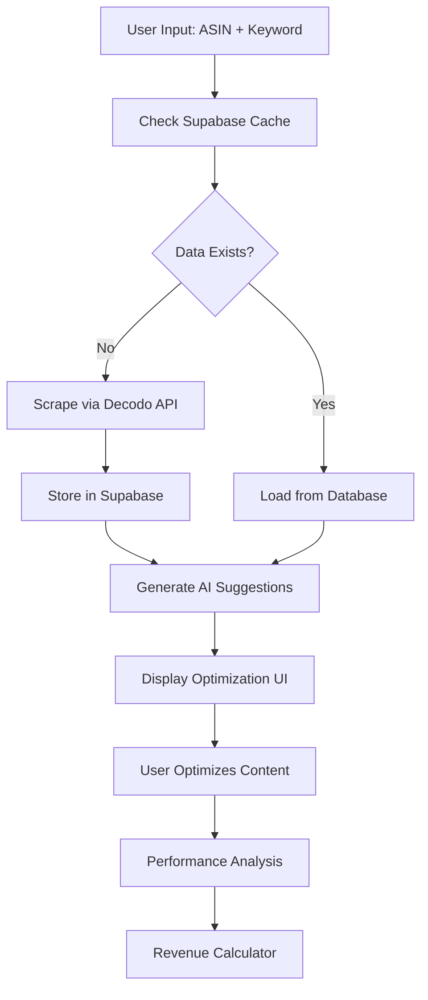

# ListingLift.ai

> **AI-powered Amazon listing optimization SaaS.**

---

## Overview

**ListingLift.ai** is a full-stack, AI-first web application for Amazon sellers. It helps users optimize their Amazon product listings using AI, competitor analysis, and real-time suggestions. Built with Next.js (App Router), React, Tailwind CSS, Shadcn UI, and Supabase.

---

## Features

### 🎯 **Core Optimization Engine**
- **Multi-Step Optimization Process**: Guided 3-step workflow (Title → Bullet Points → Description)
- **AI-Powered Title Generation**: GPT-4o generates optimized titles with CTR/conversion predictions
- **Smart Bullet Point Optimization**: Create 5 compelling, Amazon-compliant bullet points (~200 characters each)
- **Description Enhancement**: AI-powered description optimization (250+ words)
- **Real-Time Preview**: Side-by-side before/after comparison with copy functionality

### 🔍 **Competitor Intelligence**
- **Competitor Analysis**: Analyze top 10 competitors for any keyword
- **Keyword Gap Analysis**: Discover high-value keywords your competitors use that you're missing
- **Competitive Benchmarking**: Compare your listing against top performers
- **Strategic Insights**: Learn from competitor strategies and best practices

### 🤖 **AI-Powered Features**
- **GPT-4o Integration**: Advanced language model for natural, compelling copy
- **Keyword Optimization**: Intelligent keyword placement and density optimization
- **Performance Predictions**: Projected CTR and conversion rate improvements
- **Content Quality Analysis**: Ensures Amazon compliance and best practices
- **Spellcheck Integration**: AI-powered spellcheck for all content fields

### 📊 **Analytics & Revenue Impact**
- **Revenue Impact Calculator**: Project potential revenue increases from optimizations
- **Before/After Analysis**: Comprehensive comparison of original vs optimized listings
- **ROI Projections**: Calculate potential monthly revenue increases

### 🎨 **User Experience**
- **Interactive Demo**: 4-step guided demo showcasing the optimization process
- **Modern UI/UX**: Clean, intuitive interface built with Shadcn UI components
- **Responsive Design**: Optimized for desktop and mobile experiences
- **Real-Time Updates**: Instant feedback and suggestions as you work

### 🔐 **Authentication & Data Management**
- **Secure Authentication**: Powered by Supabase with email/password login
- **Data Caching**: Intelligent caching of product and competitor data
- **Fresh Data**: Automatic data refresh and real-time Amazon scraping
- **Privacy Focused**: Secure handling of all user and product data

---

## Tech Stack

### **Frontend**
- **Next.js 14** (App Router) - React framework with latest features
- **TypeScript** - Type-safe development throughout
- **Tailwind CSS** - Utility-first CSS framework
- **Shadcn UI** - High-quality, accessible component library
- **Radix UI** - Primitive components for complex UI patterns
- **Lucide Icons** - Beautiful, customizable icons

### **Backend & APIs**
- **Next.js API Routes** - Server-side API endpoints
- **OpenAI GPT-4o** - Advanced AI for content generation
- **Decodo API** - Amazon data scraping and product intelligence
- **Supabase** - Database, authentication, and real-time features

### **Database & Infrastructure**
- **Supabase PostgreSQL** - Relational database with real-time capabilities
- **Row Level Security** - Secure, user-specific data access
- **Automated Backups** - Enterprise-grade data protection

### **Development Tools**
- **ESLint & Prettier** - Code quality and formatting
- **Tailwind CSS** - Responsive design system

---

## Architecture

### **Application Structure**
```
listinglift-ai/
├── app/
│   ├── api/                    # Backend API routes
│   │   ├── bullet-points/      # Bullet point optimization
│   │   ├── decodo/            # Amazon data scraping
│   │   ├── gpt-suggest/       # AI suggestions & analysis
│   │   ├── listing-analysis/  # Performance analysis
│   │   └── spellcheck/        # AI-powered spellcheck
│   ├── globals.css            # Global styles
│   ├── layout.tsx             # Root layout component
│   └── page.tsx               # Main application component
├── components/
│   ├── ui/                    # Reusable UI components
│   └── theme-provider.tsx     # Theme management
├── hooks/                     # Custom React hooks
├── lib/                       # Utility libraries
│   ├── decodo.ts             # Decodo API integration
│   ├── supabase.ts           # Supabase client
│   └── utils.ts              # Helper functions
└── public/                   # Static assets
```

### **API Architecture**

#### **Core API Endpoints**
- `POST /api/decodo` - Scrape Amazon product and search data
- `POST /api/gpt-suggest` - Generate AI-powered optimization suggestions
- `POST /api/bullet-points` - Optimize bullet points with competitor analysis
- `POST /api/listing-analysis` - Analyze performance improvements
- `POST /api/spellcheck` - AI-powered content spellcheck

#### **Data Flow**


### **AI Integration**

#### **GPT-4o Features**
- **Title Optimization**: Keyword-rich, conversion-focused titles
- **Keyword Gap Analysis**: Competitive keyword intelligence
- **Bullet Point Generation**: Amazon-compliant, benefit-focused bullet points
- **Description Enhancement**: Long-form, SEO-optimized product descriptions

#### **Content Quality Standards**
- **Amazon Compliance**: Ensures all content meets Amazon's guidelines
- **Character Limits**: Respects Amazon's length requirements
- **Keyword Optimization**: Strategic keyword placement and density
- **Readability**: Human-friendly, engaging copy that converts

---

## Setup & Installation

### **Prerequisites**
- Node.js 18+ and npm/yarn
- Supabase account and project
- OpenAI API key
- Decodo API access

### **Installation Steps**

1. **Clone the repository:**
   ```bash
   git clone https://github.com/your-org/listinglift-ai.git
   cd listinglift-ai
   ```

2. **Install dependencies:**
   ```bash
   npm install
   # or
   yarn install
   ```

3. **Environment Setup:**
   ```bash
   cp .env.example .env.local
   ```
   
   Configure your `.env.local`:
   ```env
   # Supabase Configuration
   NEXT_PUBLIC_SUPABASE_URL=your_supabase_url
   NEXT_PUBLIC_SUPABASE_ANON_KEY=your_supabase_anon_key
   SUPABASE_SERVICE_ROLE_KEY=your_service_role_key
   
   # OpenAI Configuration
   OPENAI_API_KEY=your_openai_api_key
   
   # Decodo API Configuration
   DECODO_API_KEY=your_decodo_api_key
   DECODO_BASE_URL=https://api.decodo.ai
   ```

4. **Database Setup:**
   ```bash
   # Run Supabase migrations (if available)
   npx supabase db reset
   ```

5. **Development Server:**
   ```bash
   npm run dev
   # or
   yarn dev
   ```

6. **Production Build:**
   ```bash
   npm run build && npm start
   # or
   yarn build && yarn start
   ```

---

## API Reference

### **Authentication**
All API endpoints require user authentication via Supabase. Include the user's session token in requests.

### **Core Endpoints**

#### **Amazon Data Scraping**
```typescript
POST /api/decodo
{
  "target": "amazon_product" | "amazon_search",
  "query": "B08N5WRWNW" | "bluetooth headphones",
  "parse": true
}
```

#### **AI Suggestions**
```typescript
POST /api/gpt-suggest
Headers: { "x-ll-ai-action": "keyword-gap" | "bullet-ideas" | "description-ideas" }
{
  "currentTitle": "Product Title",
  "competitorTitles": ["Title 1", "Title 2"],
  "heroKeyword": "main keyword"
}
```

#### **Performance Analysis**
```typescript
POST /api/listing-analysis
{
  "originalListing": { title, bulletPoints, description },
  "optimizedListing": { title, bulletPoints, description },
  "heroKeyword": "main keyword"
}
```

---

## Contributing

### **Development Guidelines**
- Follow TypeScript best practices
- Use functional components and hooks
- Implement proper error handling
- Write descriptive comments for complex logic
- Maintain responsive design principles

### **Code Style**
- Use Prettier for code formatting
- Follow ESLint rules
- Use descriptive variable names
- Prefer composition over inheritance
- Keep components under 500 lines

### **Pull Request Process**
1. Fork the repository
2. Create a feature branch (`git checkout -b feature/amazing-feature`)
3. Commit changes (`git commit -m 'Add amazing feature'`)
4. Push to branch (`git push origin feature/amazing-feature`)
5. Open a Pull Request

---

## Deployment

### **Vercel (Recommended)**
```bash
npm install -g vercel
vercel --prod
```

### **Docker**
```bash
docker build -t listinglift-ai .
docker run -p 3000:3000 listinglift-ai
```

### **Environment Variables**
Ensure all environment variables are configured in your deployment platform.

---

## License

MIT License

---

## Acknowledgments

- **[Next.js](https://nextjs.org/)** - The React framework for production
- **[Supabase](https://supabase.com/)** - The open source Firebase alternative
- **[OpenAI](https://openai.com/)** - AI-powered content generation
- **[Shadcn UI](https://ui.shadcn.com/)** - Beautifully designed components
- **[Tailwind CSS](https://tailwindcss.com/)** - A utility-first CSS framework
- **[Radix UI](https://www.radix-ui.com/)** - Low-level UI primitives
- **[Decodo API](https://decodo.ai/)** - Amazon data intelligence

---

## Support

For questions, bug reports, or feature requests:
- 🐛 Issues: [GitHub Issues](https://github.com/your-org/listinglift-ai/issues)

---

**Built with ❤️ for Amazon sellers worldwide** 